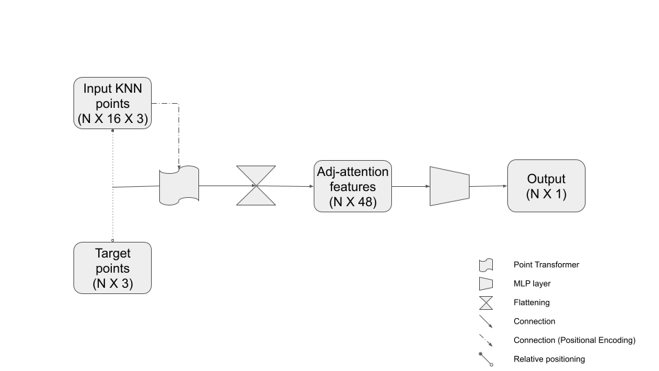

# Far Range Upsampling
Point cloud enhancement in the far range from the ego vehicle for autonomous driving

## Installation
### Create virtual environment and install dependencies
```
python -m venv venv
source venv/bin/activate
pip install -r requirements.txt
```
### Install Point Transformer package
```
pip install point-transformer-pytorch
```
The above package is the implementation of Point Transformer in Pytorch by the following paper. Separate installation is not necessary if `pip install -r requirements.txt` is run in the previous step.
```
@misc{zhao2020point,
    title={Point Transformer}, 
    author={Hengshuang Zhao and Li Jiang and Jiaya Jia and Philip Torr and Vladlen Koltun},
    year={2020},
    eprint={2012.09164},
    archivePrefix={arXiv},
    primaryClass={cs.CV}
}
```
# Far Range Upsampling
Point cloud enhancement in the far range from the ego vehicle for autonomous driving

## Installation
### Create virtual environment and install dependencies
```
python -m venv venv
source venv/bin/activate
pip install -r requirements.txt
```
### Install Point Transformer package
```
pip install point-transformer-pytorch
```
The above package is the implementation of Point Transformer in Pytorch by the following paper. **Separate installation is not necessary** if `pip install -r requirements.txt` is run in the previous step.
```
@misc{zhao2020point,
    title={Point Transformer}, 
    author={Hengshuang Zhao and Li Jiang and Jiaya Jia and Philip Torr and Vladlen Koltun},
    year={2020},
    eprint={2012.09164},
    archivePrefix={arXiv},
    primaryClass={cs.CV}
}
```
## Training the model
`train.py` is implemented to train the models. The script takes the following parameters:
```
$ python train.py -h
usage: train.py [-h] [--exp-name EXP_NAME] [--KNNstep KNNSTEP] [--patience PATIENCE]
                [--model {model0_0,model0_1,model1,model2}]
                [--loss {mse,msie,focal,combined}] [--focal-thresh FOCAL_THRESH]
                [--focal-weight FOCAL_WEIGHT]

optional arguments:
  -h, --help            show this help message and exit
  --exp-name EXP_NAME   Name of the experiment
  --KNNstep KNNSTEP     KNN step size
  --patience PATIENCE   Patience
  --model {model0_0,model0_1,model1,model2}
                        Model to use for training
  --loss {mse,msie,focal,combined}
                        Loss function
  --focal-thresh FOCAL_THRESH
                        Distance threhold required for focal loss for classification
  --focal-weight FOCAL_WEIGHT
                        Weight of the focal loss in the combined loss

```

### KNNstep
The training input file has 128 points from the sparse point cloud assigned to each of the target points in the far range. We select 16 points from them. In doing so, one can select the points with a specific step size. The data selection is handled in the `LidarData` class in `utils.py`.
```
Examples)
If KNNstep == 1, then we select ordered points at indices of [0, 1, 2, ..., 15]
If KNNstep == 2, then we select ordered points at indices of [0, 2, 4, ..., 30]
If KNNstep == 4, then we select ordered points at indices of [0, 4, 8, ..., 60]
If KNNstep == 8, then we select ordered points at indices of [0, 8, 16, ..., 120]
```

### model
We have experimented with 4 models. They can be found at `models.py`.
#### **model_0_0**
The very basic model. The first `point transformer` layer calculates the self-attention within the KNN (K=16) input points (adjacent point attention) with respect to the target point they are assigned to. The transformed features are fed into an MLP layer to generated the output.


#### **model_0_1**
In addition to `model_0_0`, self-attention within the target points are calculated.


#### **model_1**
Down-sampling and up-sampling procedured allow a U-Net-like architecture. The aggregation of information in down- and up- sampling is peformed using point transformer.


#### **model_2**
Up-sampling data aggreation is performed using trilinear interpolation.


### loss
We have experimented with 4 loss functions.
####  **MSE**

####  **MSIE**

####  **Focal Loss**
`focal-thresh` parameter defines the distance offset threshold for the classification problem. For example, if the threshold is 1000, points within 1 metre distance from the closest ground truth point are True samples.

####  **Total (combined) Loss**
`focal-weight` parameter defines the weight of the focal loss when combined with the `MSIE`.